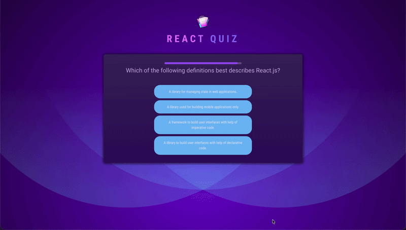

# React Interactive Quiz

[](https://vladson-quiz.netlify.app)
[](#)
[](#)

A dynamic, time-constrained interactive quiz application. Built with React, this project showcases advanced component lifecycle management, robust timer synchronization, and race-condition prevention in a highly interactive UI.

## Live Preview



[View the live application here](https://vladson-react.netlify.app)

## Key Features

- **Time-Constrained Questions:** Each question features a strict timer (e.g., 10 seconds), automatically advancing if the user does not respond.
- **Dynamic Progress Bar:** A smooth, interval-based progress bar visually tracks the remaining time for the current question.
- **Delayed Feedback Loop:** Upon selecting an answer, the UI pauses to highlight the selection, then reveals whether it was correct or wrong before transitioning to the next question.
- **Randomized Answers:** Answer options are shuffled dynamically per question to prevent predictable patterns.
- **Summary Dashboard:** Displays a final score and breakdown of correct, incorrect, and skipped questions at the end of the quiz.

## Tech Stack

- **Library:** React 19 (Hooks: `useState`, `useEffect`, `useCallback`, `useRef`)
- **Build tool:** Vite
- **Styling:** CSS
- **Language:** Modern JavaScript (ES6+)

## Architecture & Notable Implementation Details

- **Mastering Reconciliation (The `key` pattern):** Instead of manually resetting states via `useEffect` when questions change, the app leverages React's `key` prop on the `<Question>` and `<Timebar>` components. This forces React to unmount the old component and mount a fresh one, guaranteeing a clean slate (timers and local state reset) without side-effect spaghetti.
- **Race Condition Prevention (Guard Clauses):** Implements robust guard clauses using derived state to prevent users from double-clicking answers and triggering overlapping `setTimeout` threads, a common pitfall in timed React apps.
- **Stable References with `useRef`:** Answer shuffling is isolated using `useRef` (`if (!shuffledAnswers.current) ...`). This ensures that re-renders (triggered by timers or UI state changes) do not cause the answers to jump around on the screen.
- **Derived State for UI Modes:** The application dynamically calculates the state of the UI (`answered`, `correct`, `wrong`) directly during the render phase based on the core state (`selectedAnswer`, `isCorrect`), adhering to the principle of a Single Source of Truth and avoiding out-of-sync bugs.

## Getting Started

```bash
git clone https://github.com/VladsonX/react-projects.git
cd react-projects/12-quiz
npm install
npm run dev
```

## Roadmap

- [ ] Add backend integration for fetching external quiz data via TanStack Query.
- [ ] Implement local storage caching to resume an interrupted quiz.
- [ ] Add sound effects for correct/wrong answers.
